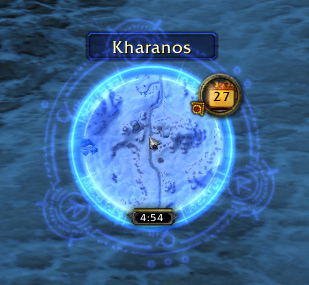
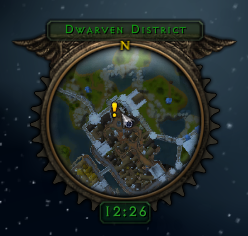
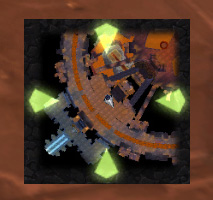
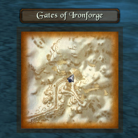
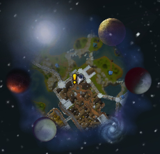

# SexyMap

SexyMap is a World of Warcraft addon that provides enhanced customization for your minimap and related frames.

## Features

### Minimap Enhancements
- **Custom Shapes**: Choose from round, square, diamond, hexagon, octagon, and other minimap shapes
- **Backdrop Options**: Add custom borders and backgrounds to your minimap
- **Scaling**: Adjust the minimap scale to fit your UI
- **Opacity Control**: Set different opacity levels for hover and normal states

### Button Management
- **Drag & Drop**: Reposition minimap buttons (tracking, calendar, mail, etc.) around the minimap edge
- **Lock/Unlock**: Lock button positions to prevent accidental moves
- **Visibility Control**: Show or hide specific minimap buttons

### Additional Features
- **Coordinates**: Display current player coordinates on the minimap
- **Zone Text**: Customize the appearance of zone text
- **Auto Zoom**: Automatically zoom minimap based on movement
- **HudMap**: Add a directional arrow for navigation

### Movers
SexyMap provides movers for various UI frames:
- **Durability Frame** (Armored Man)
- **Objectives Tracker**
- **Boss Frames** (Gunships, etc.)
- **Vehicle Seat Indicator**
- **World State Capture Bars**

## Commands

- `/minimap` - Open minimap options
- `/sexymap` - Open SexyMap options
- `/map` - Open map options

## Requirements

- WoW 3.3.5+ (Wrath of the Lich King)
- SexyMap is compatible with both retail and private servers

## Installation

1. Download or clone this repository
2. Copy the `SexyMap` folder to your `Interface/AddOns` directory
3. Restart WoW or reload your UI

## Configuration

Access the options through:
- Type `/sexymap` or `/minimap` in chat
- Or through the Blizzard Interface Options menu

## Credits

Based on the original SexyMap addon by StormFX and contributors.

## Maintainer

Maintained by **Xurkon** - Custom fixes for Ascension/Ebonhold and other private servers.

## Changes

This version includes additional fixes for private server compatibility:
- Minimap scale now persists correctly after zone changes on private servers
- Various bug fixes and improvements

## License

This project is licensed under the MIT License - see the LICENSE file for details.

## Links

- [CurseForge](https://www.curseforge.com/wow/addons/sexymap)
- [WoWInterface](https://www.wowinterface.com/downloads/info10177-SexyMap.html)

## Screenshots

